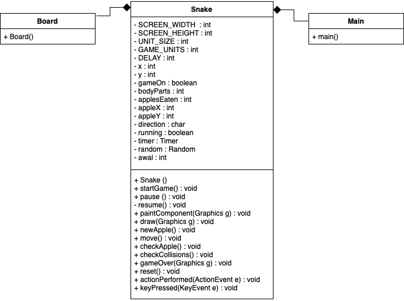

# Snake Game

This repository is a final project (Java GUI) from Object-Oriented Programming Class, Teknik Informatika Universitas Padjadjaran. 

[Challenge Guidelines](challenge-guideline.md)

**Snake Game adalah implementasi dari game terkenal yaitu Snake dimana ada seekor ular yang dapat diarahkan untuk memakan buah. Dan jika ular tersebut memakan buah, panjangnya akan bertambah.**

## Credits
| NPM           | Name        |
| ------------- |-------------|
| 140810190034  | Milyanda V. |
| 140810190042  | Diandha C.  |
| 140810190072  | Gilang A.H. |

## Change log
- **[Sprint Planning](changelog/sprint-planning.md) - (17/11/2020)** 
   -  Discussion about the planning of the project

- **[Sprint 1](changelog/sprint-1.md) - (date from 17/11/2020 until 22/11/2020)** 
   - Create The Box
   - Create the Snake 
   - Implementation of snake's movement 
   - Test the movement
   - Create the fruit

- **[Sprint 2](changelog/sprint-2.md) - (date from 23/11/2020 until 30/11/2020)** 
   - Implementation of snake's movement                           
   - Test the movement                                    
   - Create the fruit                                  
   - Have the fruit show up                          
   - Test the fruit                                              
   - Implementation of size improvement caused by fruit intake   
   - Implementation of the game's regulation                     
   
- **[Sprint 3](changelog/sprint-3.md) - (date from 01/12/2020 until 06/12/2020)** 
   - Create the score
   - Implementation of Restart and GameOver
   - Test the game
   - Fix bugs
   - Make sure the game is ready

## Running The App
   - Mengcompile Main.java di terminal 
   - Mengetik java Main di terminal
   - Mainkan Snake Game nya.

## Classes Used

Kelas yang dipakai
- Snake sebagai pusat dari game yang mencakup pergerakan snake, method - method untuk fruit, tampilan, gameover dan restart
- Board sebagai class untuk menampilkan board dari game
- Main sebagai main class

## Notable Assumption and Design App Details
 - Ular muncul dengan panjang awal 5 sel dan posisi kepala ada ditengah-tengah area game.
 - Ular akan mulai bergerak maju setelah pengguna memberikan input dengan menekan tombol spasi.
 - Dan juga setelah aplikasi dimulai buah pertama akan muncul secara random.
 - Jika buah termakan oleh ular, maka ular akan bertambah panjangnya pada bagian kepala sebanyak satu sel. Dengan kata lain, pada saat buah dimakan, buah tersebut    berubah menjadi kepala baru ular.
 - Jika game selesai, munculkan dialog baru untuk menampilkan score. Dan jika dialog ditutup, game akan mereset ke posisi awal lagi.
